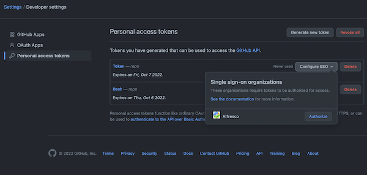

# Scripts

All scripts that contribute to improving the GitHub Actions monitoring & observability experience can be found here.

## Script to verify there are no running workflows

`gha-monitoring.sh` - This script verifies that there are no ongoing workflows for a specific branch across several ACS projects that are linked together for release purposes.
* [alfresco-community-repo](https://github.com/Alfresco/alfresco-community-repo)
* [alfresco-enterprise-repo](https://github.com/Alfresco/alfresco-enterprise-repo)
* [acs-packaging](https://github.com/Alfresco/acs-packaging)
* [acs-community-packaging](https://github.com/Alfresco/acs-community-packaging)
* [alfresco-enterprise-share](https://github.com/Alfresco/alfresco-enterprise-share)

There are 2 modes to authenticate:
* via providing [GitHub Personal Access Token](https://docs.github.com/en/authentication/keeping-your-account-and-data-secure/creating-a-personal-access-token)
* through [GitHub CLI](https://cli.github.com)

#### Creating a token
[Creating a personal access token](https://docs.github.com/en/authentication/keeping-your-account-and-data-secure/creating-a-personal-access-token) - this page provides information about creating the Personal Access Token. 
</br> You must select **repo** scope to access repositories, then you need to authorize the generated token for the **Alfresco** access.



#### Requirements
You need to have installed:
* [jq](https://stedolan.github.io/jq/) - a command-line JSON processor.
* [curl](https://curl.se) - a command-line tool for transferring data using various network protocols
* [gh](https://cli.github.com) - GitHub CLI

To run the script you should pass a value for `-m` flag to specify a mode to authenticate:
* `bash gha-monitoring.sh -m pat` - to use **Personal Access Token** - In this case, you must have the Person Access Token generated and added it as environment variable - `GITHUB_PAT`
* `bash gha-monitoring.sh -m cli` - to use **GitHub CLI**

Additionally, you can specify a branch and overwrite a default branch by passing a value for `-b` flag:
e.g <br/> `bash gha-monitoring.sh -m pat -b master` <br/> This script exits with code **0** if there are no running workflows, otherwise exits with code **1**.

As a result you can get e.g.:
```
alfresco-community-repo  
"https://github.com/Alfresco/alfresco-community-repo/actions/runs/2998918663 in_progress" 
```
or
```
There are currently no requested workflows for the specified input.
```
